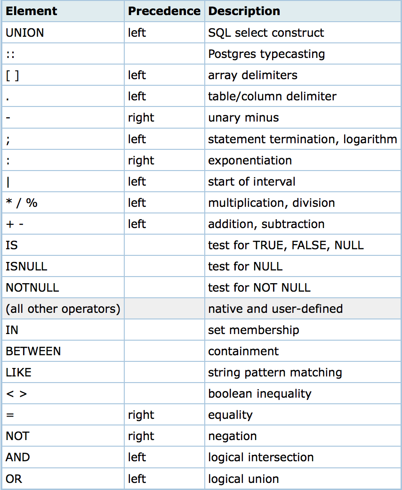

# postgreSQL Advanced

## Learning Competencies
- Getting to learn advance queries in postgreSQL
- Learning about Operators & Expressions
- Clauses, Joins and contraints in postgreSQL
- Exploring what callbacks in SQL(Triggers)
- Understand how transaction work in postgreSQL
- Search engines work well with Indexes
- DeadLocks: Can you save yourself from it?

## Overview

### QUERIES IN POSTGRESQL

- show running queries
```
SELECT procpid, age(query_start, clock_timestamp()), usename, current_query 
FROM pg_stat_activity 
WHERE current_query != '<IDLE>' AND current_query NOT ILIKE '%pg_stat_activity%' 
ORDER BY query_start desc;
```

- show running queries
```
SELECT pid, age(query_start, clock_timestamp()), usename, query 
FROM pg_stat_activity 
WHERE query != '<IDLE>' AND query NOT ILIKE '%pg_stat_activity%' 
ORDER BY query_start desc;
```

- Kill running query
```
SELECT pg_cancel_backend(procpid);
```

- kill idle query
```
SELECT pg_terminate_backend(procpid);
```

- vacuum command
```
VACUUM (VERBOSE, ANALYZE);
```

- all database users
```
select * from pg_stat_activity where current_query not like '<%';
```

- all databases and their sizes
```
select * from pg_user;
```

- all tables and their size, with/without indexes
```
select datname, pg_size_pretty(pg_database_size(datname))
from pg_database
order by pg_database_size(datname) desc;
```

- cache hit rates (should not be less than 0.99)
```
SELECT sum(heap_blks_read) as heap_read, sum(heap_blks_hit)  as heap_hit, (sum(heap_blks_hit) - sum(heap_blks_read)) / sum(heap_blks_hit) as ratio
FROM pg_statio_user_tables;
```

- table index usage rates (should not be less than 0.99)
```
SELECT relname, 100 * idx_scan / (seq_scan + idx_scan) percent_of_times_index_used, n_live_tup rows_in_table
FROM pg_stat_user_tables 
ORDER BY n_live_tup DESC;
```

- how many indexes are in cache
```
SELECT sum(idx_blks_read) as idx_read, sum(idx_blks_hit)  as idx_hit, (sum(idx_blks_hit) - sum(idx_blks_read)) / sum(idx_blks_hit) as ratio
FROM pg_statio_user_indexes;
```

- Dump database on remote host to file
```
$ pg_dump -U username -h hostname databasename > dump.sql
```

- Import dump into existing database
```
$ psql -d newdb -f dump.sql
```


### Operator in PostgreSQL

Postgres provides a large number of built-in operators on system types. These operators are declared in the system catalog pg_operator. Every entry in pg_operator includes the name of the procedure that implements the operator and the class OIDs of the input and output types.

To view all variations of the “||” string concatenation operator, try


```
    SELECT oprleft, oprright, oprresult, oprcode
    FROM pg_operator WHERE oprname = '||';

oprleft|oprright|oprresult|oprcode
-------+--------+---------+-------
     25|      25|       25|textcat
   1042|    1042|     1042|textcat
   1043|    1043|     1043|textcat
(3 rows)
```

Users may invoke operators using the operator name, as in:

```
select * from emp where salary < 40000;
```

Alternatively, users may call the functions that implement the operators directly. In this case, the query above would be expressed as:

```
select * from emp where int4lt(salary, 40000);
```

psql has a command **(\dd)** to show these operators.

#### Lexical Precedence

Operators have a precedence which is currently hardcoded into the parser. Most operators have the same precedence and are left-associative. This may lead to non-intuitive behavior; for example the boolean operators "<" and ">" have a different precedence that the boolean operators "<=" and ">=".

Operator Ordering (decreasing precedence)




### Expressions

An expression is a combination of one or more values, operators, and PostgresSQL functions that evaluate to a value.

PostgreSQL EXPRESSIONS are like formulas and they are written in query language. You can also use to query the database for specific set of data

**Syntax**

Consider the basic syntax of the SELECT statement as follows −

```
SELECT column1, column2, columnN
FROM table_name
WHERE [CONDITION | EXPRESSION];
```
There are different types of PostgreSQL expressions, which are mentioned below −

**PostgreSQL - Boolean Expressions**

PostgreSQL Boolean Expressions fetch the data on the basis of matching single value. Following is the syntax −

```
SELECT column1, column2, columnN
FROM table_name
WHERE SINGLE VALUE MATCHTING EXPRESSION;
```

Consider the table COMPANY having records as follows −

```
testdb# select * from COMPANY;
 id | name  | age | address   | salary
----+-------+-----+-----------+--------
  1 | Paul  |  32 | California|  20000
  2 | Allen |  25 | Texas     |  15000
  3 | Teddy |  23 | Norway    |  20000
  4 | Mark  |  25 | Rich-Mond |  65000
  5 | David |  27 | Texas     |  85000
  6 | Kim   |  22 | South-Hall|  45000
  7 | James |  24 | Houston   |  10000
(7 rows)
```

Here is the simple example showing usage of PostgreSQL Boolean Expressions −

```
testdb=# SELECT * FROM COMPANY WHERE SALARY = 10000;
```

The above given PostgreSQL statement will produce the following result −

```
 id | name  | age | address  | salary
----+-------+-----+----------+--------
  7 | James |  24 | Houston  |  10000
(1 row)
```


PostgreSQL - Numeric Expression
These expressions are used to perform any mathematical operation in any query. Following is the syntax −

```
SELECT numerical_expression as  OPERATION_NAME
[FROM table_name WHERE CONDITION] ;
```

Here numerical_expression is used for mathematical expression or any formula. Following is a simple example showing usage of SQL Numeric Expressions −

```
testdb=# SELECT (15 + 6) AS ADDITION ;
```

The above given PostgreSQL statement will produce the following result −
```
 addition
----------
       21
(1 row)
```

There are several built-in functions like avg(), sum(), count() to perform what is known as aggregate data calculations against a table or a specific table column.

```testdb=# SELECT COUNT(*) AS "RECORDS" FROM COMPANY;```
The above given PostgreSQL statement will produce the following result −

```
 RECORDS
---------
       7
(1 row)
```

### Clauses in PostgreSQL


#### Where Clause
The PostgreSQL WHERE clause is used to specify a condition while fetching the data from single table or joining with multiple tables.

If the given condition is satisfied, only then it returns specific value from the table. You can filter out rows that you do not want included in the result-set by using the WHERE clause.

The WHERE clause not only is used in SELECT statement, but it is also used in UPDATE, DELETE statement, etc., which we would examine in subsequent chapters.

Syntax
The basic syntax of SELECT statement with WHERE clause is as follows −

```
SELECT column1, column2, columnN
FROM table_name
WHERE [search_condition]
```

You can specify a search_condition using comparison or logical operators. like >, <, =, LIKE, NOT, etc. The following examples would make this concept clear.

You can specify a search_condition using comparison or logical operators. like >, <, =, LIKE, NOT, etc.


#### AND & OR Clauses

The PostgreSQL AND and OR operators are used to combine multiple conditions to narrow down selected data in a PostgreSQL statement. These two operators are called conjunctive operators.

These operators provide a means to make multiple comparisons with different operators in the same PostgreSQL statement.

**Syntax**

The basic syntax of AND operator with WHERE clause is as follows −

```
SELECT column1, column2, columnN
FROM table_name
WHERE [condition1] AND [condition2]...AND [conditionN];
```

You can combine N number of conditions using AND operator. For an action to be taken by the PostgreSQL statement, whether it be a transaction or query, all conditions separated by the AND must be TRUE.

### JOINS

The PostgreSQL Joins clause is used to combine records from two or more tables in a database. A JOIN is a means for combining fields from two tables by using values common to each.

Join Types in PostgreSQL are −

```
The CROSS JOIN
The INNER JOIN
The LEFT OUTER JOIN
The RIGHT OUTER JOIN
The FULL OUTER JOIN
```

### Constraints

Constraints are the rules enforced on data columns on table. These are used to prevent invalid data from being entered into the database. This ensures the accuracy and reliability of the data in the database.

Constraints could be column level or table level. Column level constraints are applied only to one column whereas table level constraints are applied to the whole table. Defining a data type for a column is a constraint in itself. For example, a column of type DATE constrains the column to valid dates.

The following are commonly used constraints available in PostgreSQL.

- NOT NULL Constraint − Ensures that a column cannot have NULL value.

- UNIQUE Constraint − Ensures that all values in a column are different.

- PRIMARY Key − Uniquely identifies each row/record in a database table.

- FOREIGN Key − Constrains data based on columns in other tables.

- CHECK Constraint − The CHECK constraint ensures that all values in a column satisfy certain conditions.

- EXCLUSION Constraint − The EXCLUDE constraint ensures that if any two rows are compared on the specified column(s) or expression(s) using the specified operator(s), not all of these comparisons will return TRUE.


#### NOT NULL Constraint
By default, a column can hold NULL values. If you do not want a column to have a NULL value, then you need to define such constraint on this column specifying that NULL is now not allowed for that column. A NOT NULL constraint is always written as a column constraint.

A NULL is not the same as no data; rather, it represents unknown data.

Example
For example, the following PostgreSQL statement creates a new table called COMPANY1 and adds five columns, three of which, ID and NAME and AGE, specify not to accept NULL values −

```
CREATE TABLE COMPANY1(
   ID INT PRIMARY KEY     NOT NULL,
   NAME           TEXT    NOT NULL,
   AGE            INT     NOT NULL,
   ADDRESS        CHAR(50),
   SALARY         REAL
);
```

#### UNIQUE Constraint

The UNIQUE Constraint prevents two records from having identical values in a particular column. In the COMPANY table, for example, you might want to prevent two or more people from having identical age.

Example

For example, the following PostgreSQL statement creates a new table called COMPANY3 and adds five columns. Here, AGE column is set to UNIQUE, so that you cannot have two records with same age −

```
CREATE TABLE COMPANY3(
   ID INT PRIMARY KEY     NOT NULL,
   NAME           TEXT    NOT NULL,
   AGE            INT     NOT NULL UNIQUE,
   ADDRESS        CHAR(50),
   SALARY         REAL    DEFAULT 50000.00
);
```


#### PRIMARY KEY Constraint

The PRIMARY KEY constraint uniquely identifies each record in a database table. There can be more UNIQUE columns, but only one primary key in a table. Primary keys are important when designing the database tables. Primary keys are unique ids.

We use them to refer to table rows. Primary keys become foreign keys in other tables, when creating relations among tables. Due to a 'longstanding coding oversight', primary keys can be NULL in SQLite. This is not the case with other databases

A primary key is a field in a table, which uniquely identifies each row/record in a database table. Primary keys must contain unique values. A primary key column cannot have NULL values.

A table can have only one primary key, which may consist of single or multiple fields. When multiple fields are used as a primary key, they are called a composite key.

If a table has a primary key defined on any field(s), then you cannot have two records having the same value of that field(s).

Example

You already have seen various examples above where we have created COMAPNY4 table with ID as primary key −

```
CREATE TABLE COMPANY4(
   ID INT PRIMARY KEY     NOT NULL,
   NAME           TEXT    NOT NULL,
   AGE            INT     NOT NULL,
   ADDRESS        CHAR(50),
   SALARY         REAL
);
```

#### FOREIGN KEY Constraint

A foreign key constraint specifies that the values in a column (or a group of columns) must match the values appearing in some row of another table. We say this maintains the referential integrity between two related tables. They are called foreign keys because the constraints are foreign; that is, outside the table. Foreign keys are sometimes called a referencing key.

Example

For example, the following PostgreSQL statement creates a new table called COMPANY5 and adds five columns.

```
CREATE TABLE COMPANY6(
   ID INT PRIMARY KEY     NOT NULL,
   NAME           TEXT    NOT NULL,
   AGE            INT     NOT NULL,
   ADDRESS        CHAR(50),
   SALARY         REAL
);
```

For example, the following PostgreSQL statement creates a new table called DEPARTMENT1, which adds three columns. The column EMP_ID is the foreign key and references the ID field of the table COMPANY6.

```
CREATE TABLE DEPARTMENT1(
   ID INT PRIMARY KEY      NOT NULL,
   DEPT           CHAR(50) NOT NULL,
   EMP_ID         INT      references COMPANY6(ID)
);
```

### Triggers

PostgreSQL Triggers are database callback functions, which are automatically performed/invoked when a specified database event occurs.

**Syntax**

The basic syntax of creating a trigger is as follows −

```
CREATE  TRIGGER trigger_name [BEFORE|AFTER|INSTEAD OF] event_name
ON table_name
[
 -- Trigger logic goes here....
];
```

Here, event_name could be INSERT, DELETE, UPDATE, and TRUNCATE database operation on the mentioned table table_name. You can optionally specify FOR EACH ROW after table name.

The following is the syntax of creating a trigger on an UPDATE operation on one or more specified columns of a table as follows −

```
CREATE  TRIGGER trigger_name [BEFORE|AFTER] UPDATE OF column_name
ON table_name
[
 -- Trigger logic goes here....
];
```

**Example**

Let us consider a case where we want to keep audit trial for every record being inserted in COMPANY table, which we will create newly as follows (Drop COMPANY table if you already have it).


```
testdb=# CREATE TABLE COMPANY(
   ID INT PRIMARY KEY     NOT NULL,
   NAME           TEXT    NOT NULL,
   AGE            INT     NOT NULL,
   ADDRESS        CHAR(50),
   SALARY         REAL
);
```

To keep audit trial, we will create a new table called AUDIT where log messages will be inserted whenever there is an entry in COMPANY table for a new record −

```
testdb=# CREATE TABLE AUDIT(
   EMP_ID INT NOT NULL,
   ENTRY_DATE TEXT NOT NULL
);
```

Here, ID is the AUDIT record ID, and EMP_ID is the ID, which will come from COMPANY table, and DATE will keep timestamp when the record will be created in COMPANY table. So now, let us create a trigger on COMPANY table as follows −

```
testdb=# CREATE TRIGGER example_trigger AFTER INSERT ON COMPANY
FOR EACH ROW EXECUTE PROCEDURE auditlogfunc();
```

Where auditlogfunc() is a PostgreSQL procedure and has the following definition −

```
CREATE OR REPLACE FUNCTION auditlogfunc() RETURNS TRIGGER AS $example_table$
   BEGIN
      INSERT INTO AUDIT(EMP_ID, ENTRY_DATE) VALUES (new.ID, current_timestamp);
      RETURN NEW;
   END;
$example_table$ LANGUAGE plpgsql;
```

Now, we will start the actual work. Let us start inserting record in COMPANY table which should result in creating an audit log record in AUDIT table. So let us create one record in COMPANY table as follows −

```
testdb=# INSERT INTO COMPANY (ID,NAME,AGE,ADDRESS,SALARY)
VALUES (1, 'Paul', 32, 'California', 20000.00 );
```

This will create one record in COMPANY table, which is as follows −

```
 id | name | age | address      | salary
----+------+-----+--------------+--------
  1 | Paul |  32 | California   |  20000
```

Same time, one record will be created in AUDIT table. This record is the result of a trigger, which we have created on INSERT operation on COMPANY table. Similarly, you can create your triggers on UPDATE and DELETE operations based on your requirements.

```
 emp_id |          entry_date
--------+-------------------------------
      1 | 2013-05-05 15:49:59.968+05:30
(1 row)
```

**Listing Trigger**

You can list down all the triggers in the current database from pg_trigger table as follows −

```
testdb=# SELECT * FROM pg_trigger;
```

**Dropping TRIGGERS**

The following is the DROP command, which can be used to drop an existing trigger −

```
testdb=# DROP TRIGGER trigger_name;
```

### Indexes

Indexes are special lookup tables that the database search engine can use to speed up data retrieval. Simply put, an index is a pointer to data in a table. An index in a database is very similar to an index in the back of a book.

For example, if you want to reference all pages in a book that discusses a certain topic, you have to first refer to the index, which lists all topics alphabetically and then refer to one or more specific page numbers.

An index helps to speed up SELECT queries and WHERE clauses; however, it slows down data input, with UPDATE and INSERT statements. Indexes can be created or dropped with no effect on the data.

Creating an index involves the CREATE INDEX statement, which allows you to name the index, to specify the table and which column or columns to index, and to indicate whether the index is in ascending or descending order.

Indexes can also be unique, similar to the UNIQUE constraint, in that the index prevents duplicate entries in the column or combination of columns on which there's an index.


#### The CREATE INDEX Command
The basic syntax of CREATE INDEX is as follows −

```
CREATE INDEX index_name ON table_name;
```

**Types of Indexes:**

- Single-Column Indexes: A single-column index is one that is created based on only one table column. 
- Multicolumn Indexes: A multicolumn index is defined on more than one column of a table
- Partial Indexes: A partial index is an index built over a subset of a table; the subset is defined by a conditional expression (called the predicate of the partial index). The index contains entries only for those table rows that satisfy the predicate.
- Implicit Indexes: Implicit indexes are indexes that are automatically created by the database server when an object is created. Indexes are automatically created for primary key constraints and unique constraints.

**When Should Indexes be Avoided?**

Although indexes are intended to enhance a database's performance, there are times when they should be avoided. The following guidelines indicate when the use of an index should be reconsidered −

Indexes should not be used on small tables.

Tables that have frequent, large batch update or insert operations.

Indexes should not be used on columns that contain a high number of NULL values.

Columns that are frequently manipulated should not be indexed.

### Transactions

A transaction is a unit of work that is performed against a database. Transactions are units or sequences of work accomplished in a logical order, whether in a manual fashion by a user or automatically by some sort of a database program.

A transaction is the propagation of one or more changes to the database. For example, if you are creating a record, updating a record, or deleting a record from the table, then you are performing transaction on the table. It is important to control transactions to ensure data integrity and to handle database errors.

Practically, you will club many PostgreSQL queries into a group and you will execute all of them together as a part of a transaction.

Properties of Transactions
Transactions have the following four standard properties, usually referred to by the acronym ACID −

- Atomicity − Ensures that all operations within the work unit are completed successfully; otherwise, the transaction is aborted at the point of failure and previous operations are rolled back to their former state.

- Consistency − Ensures that the database properly changes states upon a successfully committed transaction.

- Isolation − Enables transactions to operate independently of and transparent to each other.

- Durability − Ensures that the result or effect of a committed transaction persists in case of a system failure


The following commands are used to control transactions −

- BEGIN TRANSACTION − To start a transaction.

- COMMIT − To save the changes, alternatively you can use END TRANSACTION command.

- ROLLBACK − To rollback the changes.

**NOTE:** Transactional control commands are only used with the DML commands INSERT, UPDATE and DELETE only. They cannot be used while creating tables or dropping them because these operations are automatically committed in the database.


**Syntax**

```
COMMIT;

or

END TRANSACTION;
```


### LOCKS

#### DeadLocks
Deadlocks can occur when two transactions are waiting for each other to finish their operations. While PostgreSQL can detect them and end them with a ROLLBACK, deadlocks can still be inconvenient. To prevent your applications from running into this problem, make sure to design them in such a way that they will lock objects in the same order.

#### Advisory Locks
PostgreSQL provides means for creating locks that have application-defined meanings. These are called advisory locks. As the system does not enforce their use, it is up to the application to use them correctly. Advisory locks can be useful for locking strategies that are an awkward fit for the MVCC model.

For example, a common use of advisory locks is to emulate pessimistic locking strategies typical of the so-called "flat file" data management systems. While a flag stored in a table could be used for the same purpose, advisory locks are faster, avoid table bloat, and are automatically cleaned up by the server at the end of the session.


## Exploration
- Go and explroe [PostgreSQL Documentation](https://www.postgresql.org/docs/8.0/static/tutorial.html)
- [PostgreSQL Tutorials](http://www.postgresqltutorial.com)
- When to use [SQL Trigger](https://softwareengineering.stackexchange.com/questions/123074/sql-triggers-and-when-or-when-not-to-use-them)
