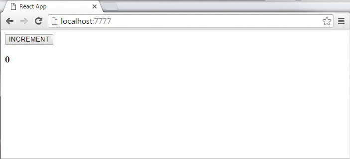

# Component lifecycle and Routing in React

## Learning Competencies

At the end of this topic you should be knowing about

- Component lifecycle methods like `componentWillMount`, `componentDidMount`, etc.
- when will the lifecycle methods will call and how to use them
- what lifecycle methods will invoke when props are updated, before rendering, after rendering, after the component is unmounted, after the first render etc.
- what is Routing in React
- Choosing our router
- How to create out routes in React
- Navigate between routes using links
- Create single page application using Routes in React

## Overview

## Component Life cycle methods

Each component has several “lifecycle methods” that you can override to run code at particular times in the process. Methods prefixed with will are called right before something happens, and methods prefixed with did are called right after something happens.

The React component, like anything else in the world, goes through the following phases

- Mounting
- Updating
- Unmounting
- Error Handling

### Mounting

These methods are called when an instance of a component is being created and inserted into the DOM:

- **`constructor()`**:  this is a special function that will get called whenever a new object is created. Calling this special function will call the constructor of our parent class and allow it to initialize itself. This is why we have access to this.props only after we’ve initially called super.
- **`componentWillMount()`**: is invoked just before mounting occurs on both the server and the client side.
- **`componentDidMount()`**: componentDidMount() is invoked immediately after a component is mounted. Initialization that requires DOM nodes should go here. If you need to load data from a remote endpoint, this is a good place to instantiate the network request. This is where AJAX requests and DOM or state updates should occur. This method is also used for integration with other JavaScript frameworks and any functions with delayed execution such as setTimeout or setInterval. We are using it to update the state so we can trigger the other lifecycle methods.
- **`render()`**: The render() method is required.

### Updating

An update can be caused by changes to props or state. These methods are called when a component is being re-rendered:

- **`componentWillReceiveProps()`**: is invoked as soon as the props are updated before another render is called. We triggered it from setNewNumber when we updated the state.
- **`shouldComponentUpdate`**: should return true or false value. This will determine if the component will be updated or not. This is set to true by default. If you are sure that the component doesn't need to render after state or props are updated, you can return false value.
- **`componentWillUpdate`**: is called just before rendering.
- *`render()`*
- **`componentDidUpdate`**: is called just after rendering.

### Unmounting

This method is called when a component is being removed from the DOM:

- **`componentWillUnmount`**: is called after the component is unmounted from the dom. We are unmounting our component in main.js.

### Error Handling

- **`componentDidCatch()`**: This method is called when there is an error during rendering, in a lifecycle method, or in the constructor of any child component.

In the following example, we will set the initial state in the constructor function. The setNewnumber is used to update the state. All the lifecycle methods are inside the Content component.

### App.jsx
```js
import React from 'react';

class App extends React.Component {

   constructor(props) {
      super(props);

      this.state = {
         data: 0
      }

      this.setNewNumber = this.setNewNumber.bind(this)
   };

   setNewNumber() {
      this.setState({data: this.state.data + 1})
   }

   render() {
      return (
         <div>
            <div>
                <button onClick = {this.setNewNumber}>INCREMENT</button>
                <Content myNumber = {this.state.data} />
            </div>
         </div>
      );
   }
}

class Content extends React.Component {

   componentWillMount() {
      console.log('Component WILL MOUNT!')
   }

   componentDidMount() {
      console.log('Component DID MOUNT!')
   }

   componentWillReceiveProps(newProps) {
      console.log('Component WILL RECIEVE PROPS!')
   }

   shouldComponentUpdate(newProps, newState) {
      return true;
   }

   componentWillUpdate(nextProps, nextState) {
      console.log('Component WILL UPDATE!');
   }

   componentDidUpdate(prevProps, prevState) {
      console.log('Component DID UPDATE!')
   }

   componentWillUnmount() {
      console.log('Component WILL UNMOUNT!')
   }

   render() {
      return (
         <div>
            <h3>{this.props.myNumber}</h3>
         </div>
      );
   }
}

export default App;
```
### main.js
```js
import React from 'react';
import ReactDOM from 'react-dom';
import App from './App.jsx';

ReactDOM.render(<App/>, document.getElementById('app'));

setTimeout(() => {
   ReactDOM.unmountComponentAtNode(document.getElementById('app'));}, 10000);
```
After the initial render, we will get the following screen.



Only componentWillMount and componentDidMount will be logged in console since we didn't update anything yet.

```console
Component WILL MOUNT!
Component DID MOUNT!
```
When we click INCREMENT button, the update will occur and other lifecycle methods will be triggered.

```console
Component WILL RECIEVE PROPS!
Component WILL UPDATE!
Component DID UPDATE!
```
After ten seconds, the component will unmount and the last event will be logged in console.
```console
Component WILL UPDATE!
```

**NOTE**: Lifecycle methods will always be invoked in the same order so it is good practice to write it in the correct order as we showed in example.

## React Router 

React Router is the standard routing library for React. From the docs:
> “React Router keeps your UI in sync with the URL. It has a simple API with powerful features like lazy code loading, dynamic route matching, and location transition handling built right in. Make the URL your first thought, not an after-thought.”

**Step 1** - Install React Router
Simple way to install react-router is to run the following code snippet in command prompt window.
```
npm install react-router
```
**Step 2** - Create Components
In this step we are creating four components. The App component will be used as a tab menu. The other three components (Home), (About) and (Contact) are rendered once the route has changed.
```js
main.js
import React from 'react';
import ReactDOM from 'react-dom';
import { Router, Route, Link, browserHistory, IndexRoute  } from 'react-router'

class App extends React.Component {
   render() {
      return (
         <div>
         <div>
            <ul>
               <li>Home</li>
               <li>About</li>
               <li>Contact</li>
            </ul>
                
           {this.props.children}
        </div>
         </div>
      );
   }
}

export default App;

class Home extends React.Component {
   render() {
      return (
         <div>
            <h1>Home...</h1>
         </div>
      )
   }
}

export default Home;

class About extends React.Component {
   render() {
      return (
         <div>
            <h1>About...</h1>
         </div>
      )
   }
}

export default About;

class Contact extends React.Component {
   render() {
      return (
         <div>
            <h1>Contact...</h1>
         </div>
      )
   }
}

export default Contact;
```

**Step 3** - Add Router
Now we want to add routes to our app. Instead of rendering App element like in previous examples, this time the Router will be rendered. We will also set components for each route.
```js
main.js
ReactDOM.render((
   <Router history = {browserHistory}>
      <Route path = "/" component = {App}>
         <IndexRoute component = {Home} />
         <Route path = "home" component = {Home} />
         <Route path = "about" component = {About} />
         <Route path = "contact" component = {Contact} />
      </Route>
   </Router>
    
), document.getElementById('app'))
```
When the app is started, we will see three clickable links that can be used to change the route.

## Exploration

- Read about [Component Life cycle](https://medium.com/@baphemot/understanding-reactjs-component-life-cycle-823a640b3e8d)
- [LifeCycle](https://reactjs.org/docs/react-component.html#componentwillmount) from React Official Doc
- Component lifecycle methods [deep dive](https://hackernoon.com/reactjs-component-lifecycle-methods-a-deep-dive-38275d9d13c0)
- **Must read**: [React Routing](https://medium.com/@pshrmn/a-simple-react-router-v4-tutorial-7f23ff27adf)
- Learn more about [Routing(https://scotch.io/tutorials/routing-react-apps-the-complete-guide)
